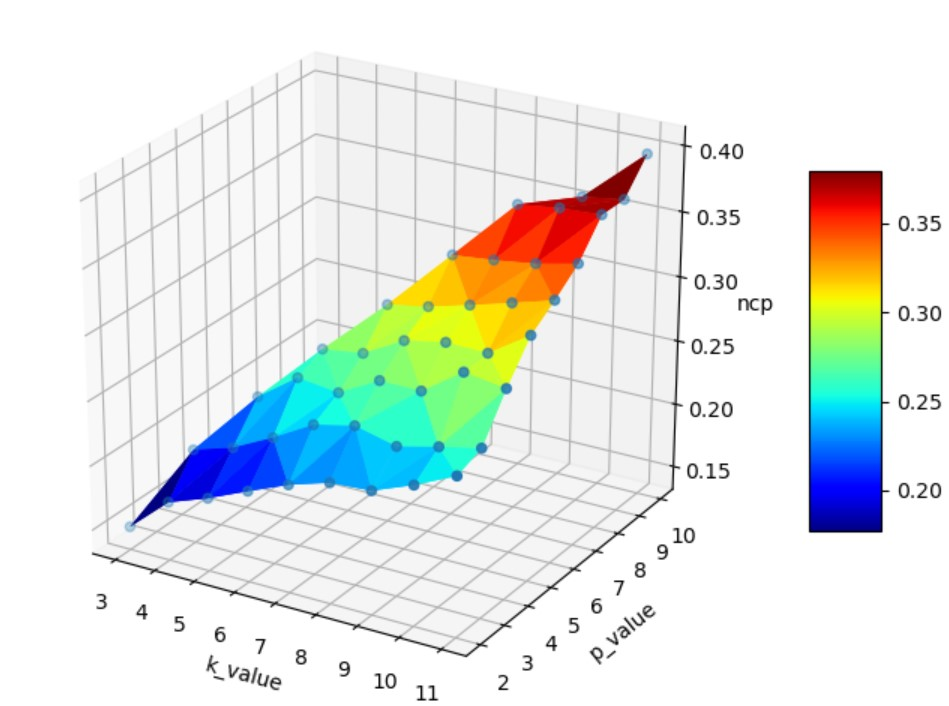

## Project for Data Protection and Privacy - Time Series Anonymization with (k,P)-anonymity

## Requirements
- `numpy v1.16.4`
- `pandas v0.25.0`
- `loguru v0.3.2`
- `saxpy v1.0.1.dev167`
- `matplotlib v3.1.3`

## Datasets
In the [datasets](/datasets "datasets") folder there are two different example datasets. All dataset must be **.csv** and must have the columns name in the first row.  
Our example datasets:
- [Products.csv](datasets/Products.csv "Products.csv")
- [UrbanPopulation.csv](datasets/UrbanPopulation.csv "UrbanPopulation.csv")

## Usage 
- Single test  
	Run the [main.py](src/main.py "main.py") file:  
	`[*] Usage: python kp-anonymity.py k_value p_value paa_value max_level dataset.csv`  
	Where k_value must be greater than p_value, max_level must be greater than 2 and lower than 20.  
	This program generates the kp-anonymization of the input dataset in a new file in the [outputs](outputs "outputs") folder.

- Multiple test  
	Run the [test.py](src/test.py "test.py") file:  
	`[*] Usage: python test.py dataset.csv multitest`  
	This test runs the [main.py](src/main.py "main.py") many times and creates a .csv file containing all the average values of the NCPs (Normalized Certainty Penalty) of each table, saved in the [final_table](final_table "final_table") folder.

- Plot  
	Run the [test.py](src/test.py "test.py") file:  
	`[*] Usage: python test.py dataset.csv plot`  
	This test can be done only if you have an output in [final_table](final_table "final_table") folder.  
	This test plots the output data from **multiple test** step in a three-dimensional or bi-dimensional chart.  
	The program chooses the pair (paa_value, max_level) that produces the best NCP. Then it plots only tuples with that values of the pair (paa_value, max_level).  
  
   

## Explain Parameters   
- `k_value` value of k-anonymity   
- `p_value` value of p-anonymity, the pattern   
- `paa_value` length of the string that can be used to describe the pattern   
- `max_level` number of letters in the alphabet used to describe the pattern   
