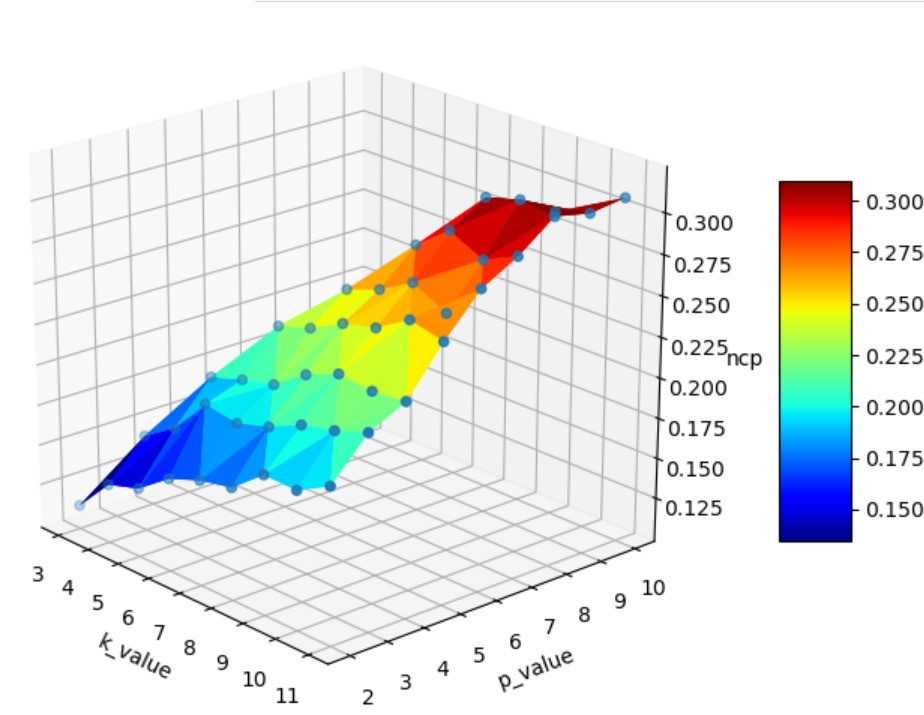

## Project for Data Protection and Privacy - Time Series Anonymization with (k,P)-anonymity
## Usage
- Single test
	Run the **main.py** file:
	`[*] Usage: python kp-anonymity.py k_value p_value paa_value max_level dataset.csv`
	Where k_value must be greater than p_value, max_level must be greater than 2 and lower than 20.
	This file outputs the kp-anonymisation, of the input dataset, in a new file in the **outputs** folder.

- Multiple test
	Run the **test.py** file:
	`[*] Usage: python test.py dataset.csv multitest`
	This test runs the **main.py** many times and creates a .csv file containing all the average values of the ncp of each table, saved in the **final_table** folder 

- Plot
	Run the **test.py** file:
	`[*] Usage: python test.py dataset.csv plot`
	This test must be done only if you have the multiple test output in the **final_table**.
	This test plots in a three-dimensional chart the output data from the **multiple test** step.
	The program chooses the max_level and paa_value pair that has the best ncp, than it plots only tuples with that data.
  
   
